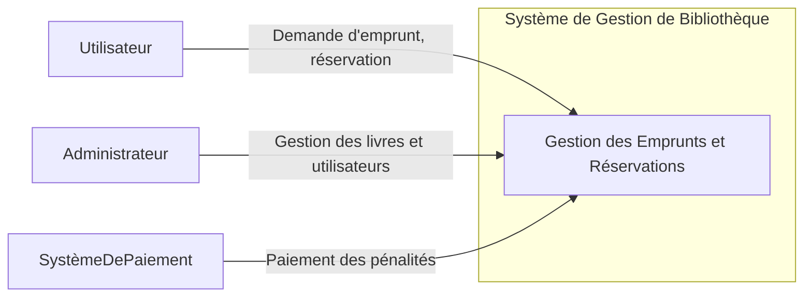
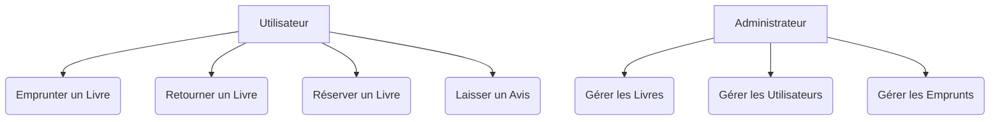
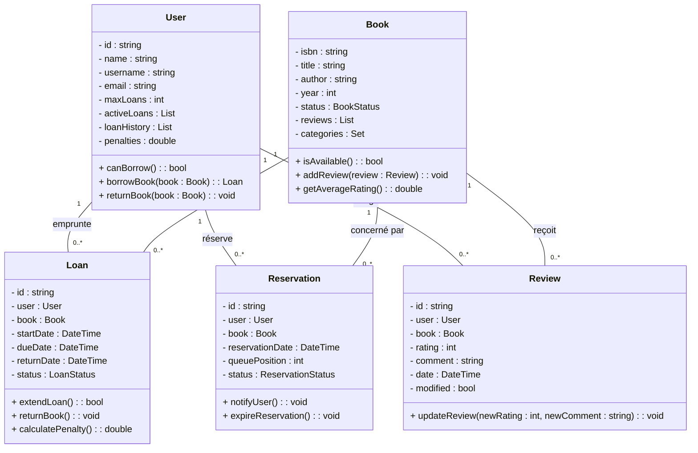
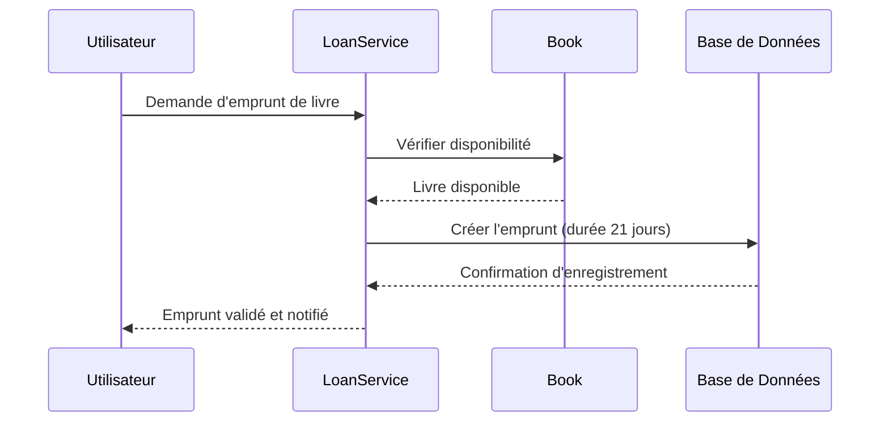
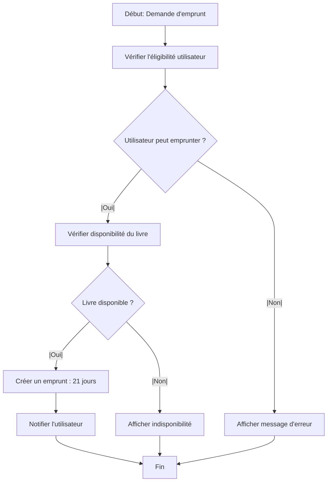
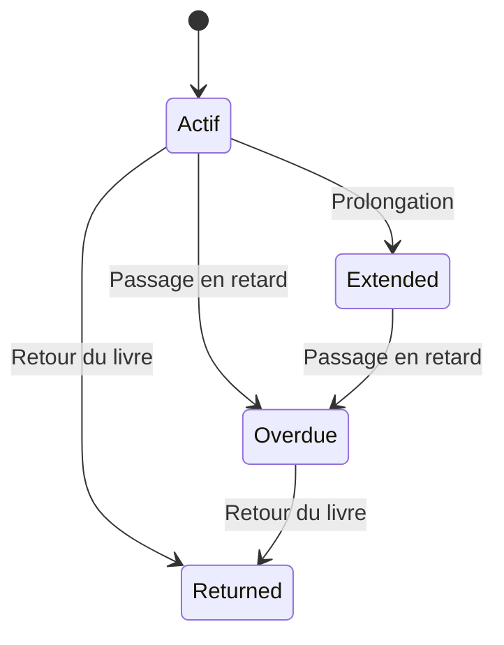
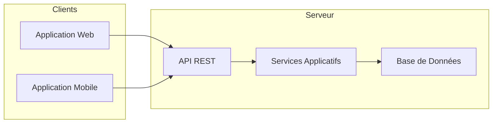
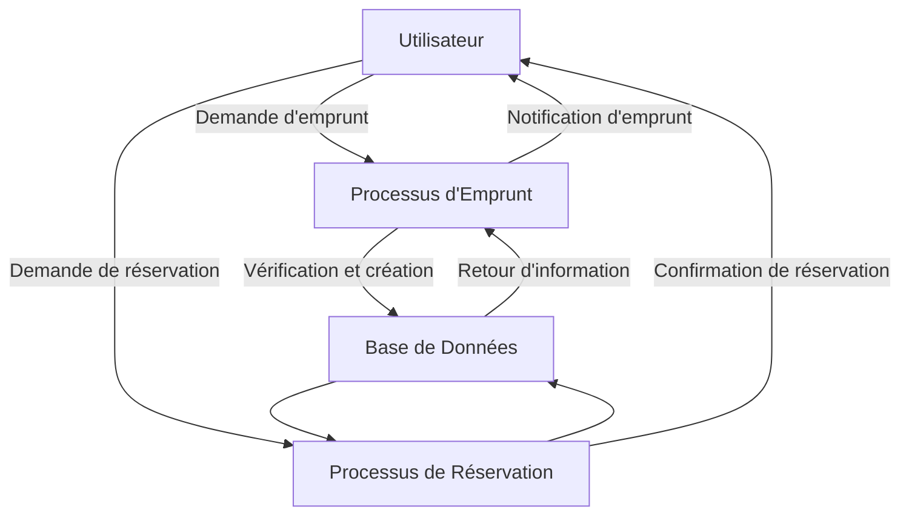
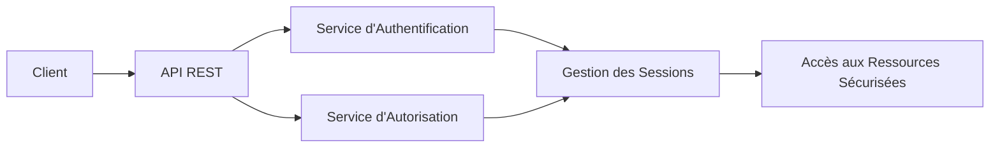
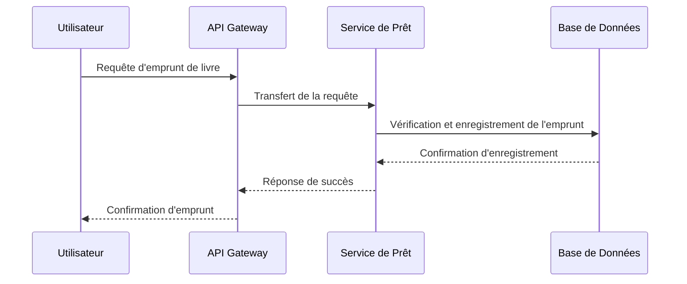

# Système de Gestion de Bibliothèque

Ce document constitue le README pour le projet de gestion de bibliothèque. Il décrit l'architecture globale, les diagrammes de conception et les aspects techniques à considérer pour la mise en place d'une solution robuste et évolutive dans un contexte d'entreprise.

## Table des Matières

- [Système de Gestion de Bibliothèque](#système-de-gestion-de-bibliothèque)
  - [Table des Matières](#table-des-matières)
  - [Introduction](#introduction)
  - [Architecture du Système](#architecture-du-système)
  - [Diagrammes de Conception](#diagrammes-de-conception)
    - [1. Diagramme de Contexte](#1-diagramme-de-contexte)
    - [2. Diagramme de Cas d'Utilisation](#2-diagramme-de-cas-dutilisation)
    - [3. Diagramme de Classes](#3-diagramme-de-classes)
    - [4. Diagramme de Séquence](#4-diagramme-de-séquence)
    - [5. Diagramme d'Activité](#5-diagramme-dactivité)
    - [6. Diagramme d'État](#6-diagramme-détat)
    - [7. Diagramme de Déploiement](#7-diagramme-de-déploiement)
    - [8. Diagramme de Flux de Données (DFD)](#8-diagramme-de-flux-de-données-dfd)
    - [9. Diagramme de Sécurité](#9-diagramme-de-sécurité)
    - [10. Diagramme de Communication](#10-diagramme-de-communication)
  - [Conclusion](#conclusion)
  - [Licences et Références](#licences-et-références)

## Introduction

Le système de gestion de bibliothèque proposé vise à gérer l'ensemble des processus liés aux emprunts, réservations, retours, et avis sur les livres. Conçu autour d'une architecture en couches, il met en œuvre une modélisation orientée domaine (Domain-Driven Design) afin d'assurer une solution évolutive et maintenable en entreprise.

## Architecture du Système

L'architecture se compose de trois couches principales :

1. **Couche Domaine**  
   Contient la logique métier et les entités principales (User, Book, Loan, Reservation, Review).  
2. **Couche Applicative (Services)**  
   Ordonne les cas d'usage en orchestrant les interactions entre les entités.  
3. **Couche Infrastructure**  
   Gère la persistance des données, la communication réseau et la gestion de la concurrence.

Cette séparation permet de garantir une évolutivité, une facilité de test et une maintenance simplifiée du système.

## Diagrammes de Conception

### 1. Diagramme de Contexte

Ce diagramme définit les limites du système et montre ses interactions avec les acteurs externes.

### 2. Diagramme de Cas d'Utilisation

Ce diagramme illustre les scénarios fonctionnels et les interactions entre les acteurs et le système.

### 3. Diagramme de Classes

Ce diagramme décrit la structure du domaine en montrant les entités, leurs attributs et leurs relations.

### 4. Diagramme de Séquence

Ce diagramme détaille l’ordre chronologique des interactions pour le processus d’emprunt.

### 5. Diagramme d'Activité

Ce diagramme représente le workflow complet du processus d’emprunt, depuis la demande jusqu’à la notification.

### 6. Diagramme d'État

Ce diagramme montre les différents états possibles d’un prêt et les transitions entre ces états.

### 7. Diagramme de Déploiement

Ce diagramme illustre la distribution physique du système sur l'infrastructure matérielle et les interactions entre les composants.

### 8. Diagramme de Flux de Données (DFD)

Ce diagramme représente les flux d'informations entre les processus du système, les sources externes et les bases de données.

### 9. Diagramme de Sécurité

Ce diagramme met en avant les composants liés à l'authentification, l'autorisation et la protection des ressources.

### 10. Diagramme de Communication

Ce diagramme se focalise sur la structure et le contenu des échanges de messages entre les composants du système.

## Conclusion

Ces diagrammes offrent une vue complète et détaillée du système de gestion de bibliothèque. Ils servent à documenter, communiquer et guider le développement du projet en assurant une compréhension commune entre les équipes techniques et métiers. Ce README constitue ainsi une base solide pour la conception et l'évolution du système.

## Licences et Références

- Ce projet est sous licence MIT.
- Les diagrammes Mermaid sont générés à partir des spécifications de [MermaidJS](https://mermaid.js.org/).

