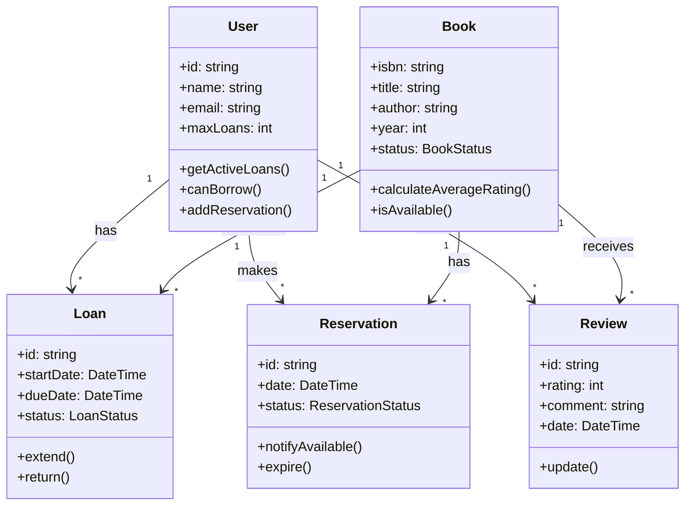

Je vais faire une modélisation complète du système avec les règles métier, en utilisant une approche UML et en détaillant chaque composant.

**1. Classes Principales et leurs Relations**

A. **Utilisateur (User)**
- Attributs:
  - ID unique
  - Nom, prénom
  - Email
  - Nombre maximum d'emprunts autorisés (par défaut: 5)
  - Liste des emprunts en cours
  - Historique des emprunts
  - Pénalités éventuelles

Règles métier:
- Un utilisateur ne peut pas emprunter plus de 5 livres simultanément
- Un utilisateur avec des pénalités ne peut pas emprunter
- Un utilisateur peut réserver jusqu'à 3 livres en attente

B. **Livre (Book)**
- Attributs:
  - ISBN (identifiant unique)
  - Titre
  - Auteur
  - Année de publication
  - État (disponible, emprunté, réservé)
  - Liste des avis
  - Catégories/Tags
  - Nombre d'exemplaires

Règles métier:
- Un livre peut avoir plusieurs exemplaires
- Un livre peut être dans plusieurs catégories
- La note moyenne doit être recalculée à chaque nouvel avis

C. **Emprunt (Loan)**
- Attributs:
  - ID de l'emprunt
  - Référence vers le livre
  - Référence vers l'utilisateur
  - Date d'emprunt
  - Date de retour prévue
  - Date de retour effective
  - État (en cours, retourné, en retard)

Règles métier:
- Durée maximum d'emprunt: 21 jours
- Possibilité de prolongation unique de 14 jours si pas de réservation
- Pénalité appliquée après retard (1€/jour)

D. **Réservation (Reservation)**
- Attributs:
  - ID de réservation
  - Référence vers le livre
  - Référence vers l'utilisateur
  - Date de réservation
  - Position dans la file
  - État (en attente, notifié, expiré)

Règles métier:
- Durée de validité après notification: 48 heures
- Un utilisateur ne peut pas réserver un livre déjà emprunté par lui
- Liste d'attente FIFO

E. **Avis (Review)**
- Attributs:
  - ID de l'avis
  - Référence vers le livre
  - Référence vers l'utilisateur
  - Note (1-5)
  - Commentaire
  - Date de publication

Règles métier:
- Un utilisateur ne peut laisser qu'un avis par livre
- L'avis ne peut être modifié qu'une seule fois
- L'avis ne peut être laissé que si le livre a été emprunté

**2. Systèmes Auxiliaires**

A. **Système de Notification**
- Gestion des notifications pour:
  - Retards
  - Disponibilité des réservations
  - Rappels de retour proche

B. **Système de Recherche**
- Recherche par:
  - ISBN, titre, auteur
  - Catégories
  - Disponibilité
  - Note moyenne
  - Recherche combinée

C. **Système de Recommandation**
- Basé sur:
  - Historique d'emprunts
  - Catégories préférées
  - Notes données
  - Livres populaires

**3. Diagramme de Classes Simplifié:**

**4. Flux de Données Principaux**

A. **Processus d'Emprunt**
1. Vérification de l'éligibilité de l'utilisateur
2. Vérification de la disponibilité du livre
3. Création de l'emprunt
4. Mise à jour du stock
5. Notification de la date de retour

B. **Processus de Réservation**
1. Vérification des conditions de réservation
2. Ajout à la file d'attente
3. Notification lors de la disponibilité
4. Gestion du délai de récupération

C. **Processus de Retour**
1. Vérification de l'état du livre
2. Calcul des pénalités éventuelles
3. Mise à jour des disponibilités
4. Notification des utilisateurs en attente

Voulez-vous que je détaille davantage une partie spécifique de cette modélisation ou que nous passions à l'implémentation d'un composant particulier ?